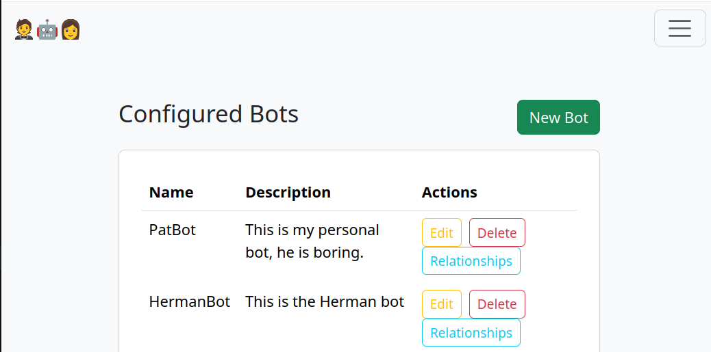

# Discona

A Discord bot management system for running multiple LLM-powered bots against a local OpenAI-compatible server (llama.cpp, Ollama, etc.).



## Overview

Discona has two components that run independently:

- **Web UI** (`app.py`) — a password-protected Flask interface for creating and managing bots, their personalities, and user relationships
- **Bot runner** (`discord_llama.py`) — connects a single configured bot to Discord and routes messages to your local LLM

Bots can respond when directly @mentioned or chime in unprompted when configured trigger words appear in chat, with a configurable probability.

## Prerequisites

- Python 3.8+
- A running OpenAI-compatible LLM server (e.g. [llama.cpp](https://github.com/ggerganov/llama.cpp) with `--server`)
- A Discord application and bot token for each bot ([Discord Developer Portal](https://discord.com/developers/applications))

## Installation

```sh
git clone https://github.com/yourname/discona.git
cd discona
```

Using **uv** (recommended):
```sh
uv venv && source .venv/bin/activate
uv pip install -r requirements.txt
```

Using **pip**:
```sh
pip install -r requirements.txt
```

Copy the example environment file and edit it:

```sh
cp .env.example .env
```

## Configuration

Edit `.env`:

| Variable | Default | Description |
|---|---|---|
| `DATA_DIR` | `.` | Directory where BSON data files are stored |
| `ADMIN_PASSWORD` | `admin` | Web UI login password — change this! |
| `SECRET_KEY` | `dev_secret` | Flask session secret — change in production! |
| `API_TOKEN` | *(unset)* | If set, the machine-readable API endpoints require `?token=...` |

LLM settings (base URL, model name, temperature, history window) are managed through the web UI under **System**.

## Running

**Start the web UI** (port 5001):
```sh
./discona-web.sh
```
Then open `http://localhost:5001` and log in with your `ADMIN_PASSWORD`.

**Start all configured bots:**
```sh
./discona.sh
```

**Run a single bot by ID** (the ID is shown in the web UI URL when editing a bot):
```sh
python discord_llama.py <bot_id>
```

The web UI and bot runner(s) can run simultaneously — they share state through the same BSON files.

## Bot Configuration

Each bot has the following fields:

| Field | Description |
|---|---|
| **Name** | Display name |
| **Description** | Short summary (shown in the UI only) |
| **Backstory** | First section of the system prompt |
| **Personality** | Second section of the system prompt |
| **Writing Sample** | Third section — examples of how the bot writes |
| **Discord API Key** | Bot token from the Discord Developer Portal |
| **Trigger Words** | Comma-separated words that may cause the bot to reply unprompted (word-boundary, case-insensitive matching) |
| **Activity Level** | Probability (0.0–1.0) of replying when a trigger word is seen |
| **Model Name** | *(optional)* Overrides the system model for this bot |
| **Temperature** | *(optional)* Overrides the system temperature for this bot |
| **Enabled** | Turn a bot on/off from the bot list without deleting it |

The bot's full system prompt is `backstory + personality + writing_sample`, optionally extended with relationship facts when a known user sends a message.

## Relationships

Each bot can have a **Relationships** list — per-username free-text facts that get appended to the system prompt when that Discord user sends a message. Useful for giving a bot memory about specific people.

Managed via the **Relationships** button on the bot list in the web UI.

## How Bots Respond

1. **Direct mention** — if the bot is @mentioned, it always replies (as a threaded reply) using the full `question_prompt` template.
2. **Trigger words** — if the message contains any configured trigger word (matched case-insensitively on word boundaries) and a random roll beats the activity level, the bot replies using the `trigger_prompt` template (which hints that a reply is optional). A bot won't do both in one message.

History is only fetched and the LLM only called when the bot is actually going to reply — the bot ignores everything else, which keeps busy channels cheap. The (potentially slow) LLM call runs off the Discord event loop, so slow responses never cause gateway timeouts, and a typing indicator is shown while the bot "thinks".

Responses longer than 2000 characters are split into multiple Discord messages at newline boundaries (with ` ``` ` code fences kept balanced across chunks so Discord doesn't render half a message as code). `@here`/`@everyone`/`@channel` output from the model is de-@'d so a bot can never ping a whole room.

## Data Storage

All data is stored as BSON flat files via [moofile](https://github.com/patw/moofile):

- `bots.bson` — bot configurations
- `relationships.bson` — per-bot user relationship facts  
- `system_config.bson` — LLM connection settings

No database server required.

## License

MIT — see [LICENSE](LICENSE).
